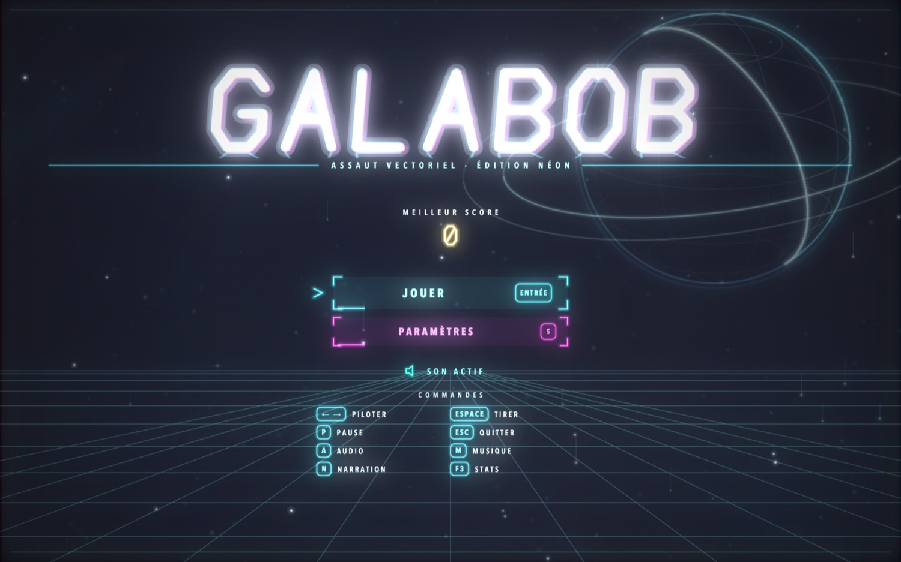
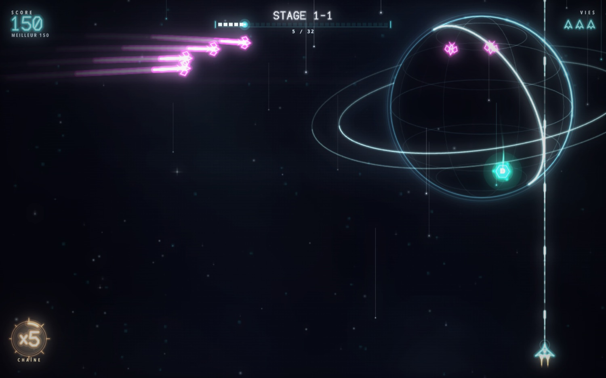

# GALABOB

**Un shoot'em up néon vectoriel en JavaScript pur.** Pas de moteur, pas de framework, pas de build : du Canvas 2D et rien d'autre.



## Ce que c'est

Un hommage à Galaga, repensé pour la sensation. Tout ce qui bouge laisse une traînée lumineuse, tout ce qui meurt explose en gerbe, et chaque impact fige brièvement l'image avant de secouer la caméra.



*Une planète à anneaux en fil de fer, des traînées qui persistent, le multiplicateur de chaîne en bas à gauche, et l'objectif du stage en haut.*

## Ce qu'il y a dedans

**Le rendu.** Un moteur de bloom maison : la scène est dessinée dans un buffer émissif hors-écran, flouté en deux passes, puis recomposé en additif. Par-dessus, aberration chromatique et vignette. Les vaisseaux sont des tracés vectoriels — noyau clair, halo saturé — jamais des formes pleines.

**Le ressenti.** Hitstop à cumul amorti, screenshake par trauma piloté par un bruit lissé, flash plein écran, recul d'arme, éclat au canon. La hitbox du joueur est réduite à quelques pixels, façon Ikaruga : on frôle sans mourir.

**Les traînées.** Buffer persistant atténué par purge roulante — chaque frame nettoie une bande différente, ce qui casse l'arrondi 8 bits et permet des traînées longues sans le voile résiduel qui les accompagne d'habitude.

**Le monde.** 100 stages Arcade et une campagne Assaut de 30 secteurs, avec des formations et des ciels évolutifs : nébuleuses, planètes vectorielles à anneaux, lunes en orbite. Comètes, pluies de météores, éclipses et tempêtes magnétiques traversent le décor.

**Les boss.** Un tous les cinq stages, en trois phases chacun. *La Ruche* libère des essaims. *Le Prisme* se scinde en fragments qui renvoient ses rayons. *Le Serpent* ondule et perd ses segments un par un. *Le Cœur* recombine les trois.

**L'arsenal.** Seize power-ups sur trois emplacements indépendants. En Assaut, Double et Spread sont des extensions permanentes ; les armes lourdes trouvées sur le terrain utilisent des munitions. Entre les secteurs, le vaisseau entre dans une salle d'arsenal jouable où les achats et le choix de la prochaine route se font en tirant.

**Le son.** Entièrement synthétisé en Web Audio — aucun fichier audio. Chaque bruitage est généré à la volée avec une légère variation pour ne jamais lasser.

## Jouer

Le jeu a besoin d'un serveur local (les scripts et le manifeste audio sont chargés par HTTP) :

```bash
python3 -m http.server 8000
```

Puis ouvrir <http://localhost:8000>.

Avec Node.js 20 ou plus récent, les contrôles automatisés du projet se lancent
sans installer de dépendance :

```bash
npm run check
```

| Touche | Action |
|---|---|
| ← → | Déplacer |
| ZQSD / flèches (Assaut) | Se déplacer librement dans la zone basse |
| Espace | Tirer (maintenir pour l'auto-fire) |
| P | Pause |
| A | Réglages audio |
| F3 | Statistiques de debug |

Pour ajouter tes propres musiques ou narrations : **dépose simplement les fichiers** dans `assets/audio/musique/` ou `assets/audio/narration/`. Le jeu lit le contenu du dossier au chargement — une seule requête, rien à déclarer. Les formats `mp3`, `ogg`, `wav`, `m4a`, `aac`, `flac`, `opus` et `webm` sont reconnus, accents et espaces compris.

Si tu veux fixer l'ordre des pistes, leur donner un titre ou corriger le volume de l'une d'elles, déclare-les dans `assets/audio/manifest.json` — il prend alors le pas sur la détection automatique :

```json
"pistes": ["intro.mp3", { "fichier": "trop_fort.wav", "titre": "Assaut final", "gain": 0.6 }]
```

Sans aucune piste, une nappe musicale procédurale prend le relais.

## Sous le capot

Tout le mouvement est exprimé en **pixels par seconde** et intégré avec le delta-time : le jeu se comporte identiquement à 30, 60 ou 144 Hz. Le canvas suit le `devicePixelRatio`, donc le rendu est net sur écran Retina. Une frame complète coûte environ **4 ms** en 3024×1890, soit un quart du budget d'un affichage à 60 Hz.

```
js/
├── core/       config, palette, entrées, stages
├── entities/   joueur, ennemis, boss, projectiles, effets, power-ups, étoiles
├── render/     moteur néon (bloom), décors
├── ui/         HUD, menus
└── audio/      synthèse procédurale
```

La migration vers une architecture modulaire est documentée dans
[`docs/architecture.md`](docs/architecture.md). Le runtime moderne expose un
registre de modes ; le gameplay actuel est son premier mode, `arcade`.
Les objectifs produit et leur ordre sont conservés dans
[`docs/roadmap.md`](docs/roadmap.md).

## Licence

Libre d'utilisation à des fins éducatives.
